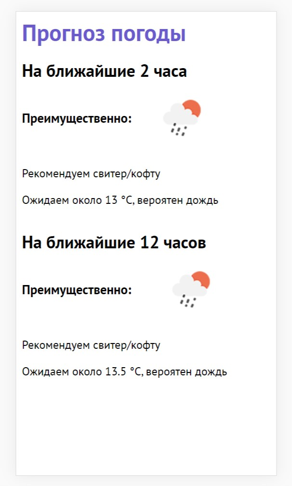

# Умный сервис прогноза погоды

Сервис призван помогать пользователю быстро определить погоду в своем населенном пункте и советовать, а что необходимо надеть сегодня на улицу, чтобы чувствовать себя комфортно.

> Уровень сложности - средний

Для реализации использовались HTML, CSS и VanillaJS.
Кроме это для получения данных о местоположени использовался Geolocation Web API

Сайт адаптирован для мобильных устройств, но может использоваться и на десктопах.

Формат ответа от сервиса представляет два блока с информацией и рекомендациями:

- первый блок выдаёт рекомендации на ближайшие 2 часа
- второй блок выдаёт рекомендации на ближайшие 12 часов

При этом для каждого из блоков предоставляется следующая информация:

- картинка наиболее вероятного или негативного сценария погоды
- средняя температура для указанных интервалов времени
- рекоментации по одежде, исходя из рассчитанной средней температуры
- оповещение о предстоящих осадках на этих интервалах времени

## Как запустить программу

> Сборка не требуется, достаточно просто скопировать и открыть index.html

## Пример интерфейса программы

